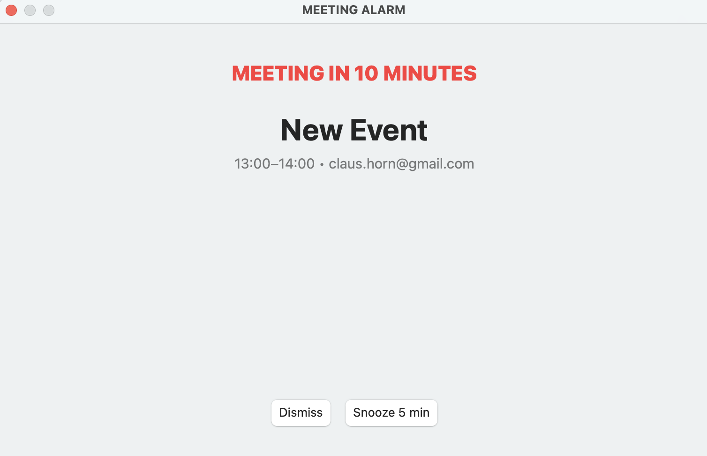

# 📅 Meeting Alarm

Never miss a meeting again. A lightweight macOS app that delivers **bold, unmissable reminders** before your calendar events.



## ✨ Features

- **Aggressive Reminders** — Loud audio + always-on-top pop-up notifications that you literally cannot ignore
- **Calendar Integration** — Syncs with your Mac's Calendar app to know when your next meeting starts
- **Customizable Timing** — Get reminded 10 minutes (or any interval) before each meeting
- **Quick Actions** — Dismiss the alert or snooze for 5 minutes with one click
- **Lightweight & Fast** — Minimal resource footprint, runs quietly in the background
- **macOS Native** — Built with Swift for seamless integration with your Mac

## 🎯 Why Meeting Alarm?

Missed meetings cost time. Forgotten invites derail projects. Slack notifications get buried. Your browser tabs get lost. Meeting Alarm sits on top of **everything** — it's impossible to miss.

Perfect for:
- Busy professionals juggling multiple meetings
- Remote workers who lose track of time
- Team leads coordinating across time zones
- Anyone who's ever said "I totally forgot!"

## 🚀 Getting Started

### Installation

1. Clone the repository:
   ```bash
   git clone https://github.com/claushorn/MeetingReminderApp.git
   cd MeetingReminderApp
   ```

2. Build and install:
   ```bash
   ./install.sh
   ```
   Or manually:
   ```bash
   ./build.sh
   ```

3. Run the app:
   ```bash
   open Meeting_Alarm.app
   ```

### Requirements

- macOS 10.12+
- Calendar app with at least one calendar enabled
- Permission to access Calendar (requested on first launch)

## 📖 How to Use

1. **Launch** the Meeting Alarm app
2. **Grant calendar access** when prompted (one-time setup)
3. **Set your reminder time** (default: 10 minutes before)
4. **Let it run** — the app sits in the background and watches your calendar
5. **When a meeting approaches**, you'll get:
   - 🔔 A loud audio alert
   - 🪟 A large pop-up window that stays on top of all other windows
   - ⏱️ Time remaining until the meeting starts

6. **Respond** by clicking "Dismiss" or "Snooze 5 min" — whatever keeps you on track

## 🔧 Technical Details

- **Language:** Swift
- **Framework:** Cocoa/AppKit
- **Target:** macOS 10.12+
- **Architecture:** Single-window app with calendar event polling

## 📝 License

MIT License — see LICENSE file for details

## 🤝 Contributing

Found a bug? Want to improve it? Contributions welcome!

---

**Stop missing meetings. Start using Meeting Alarm.**
